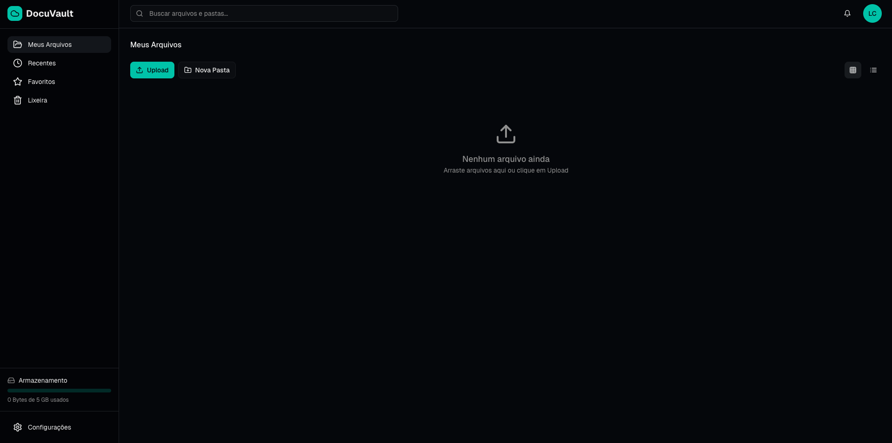
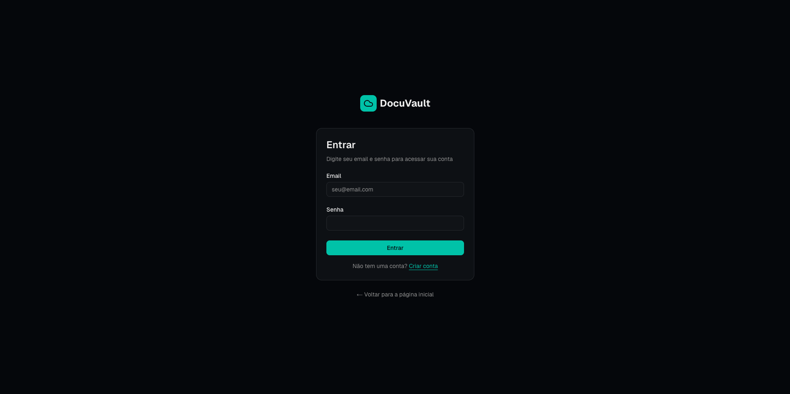
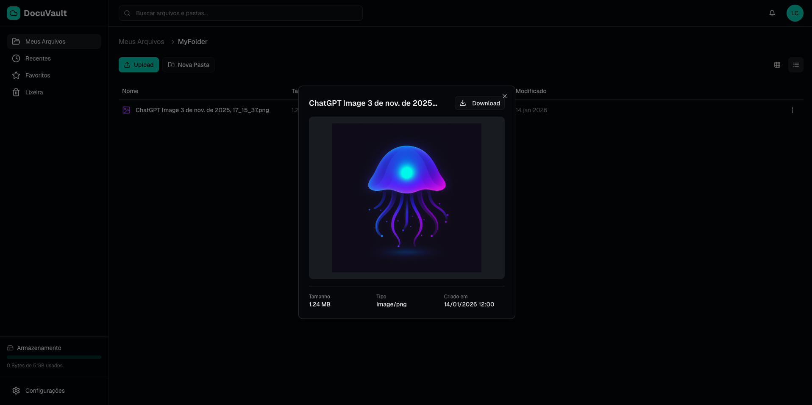
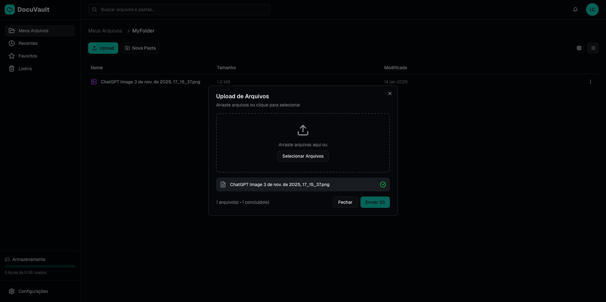

# DMS Wasp-193b

## Product and Architecture Decisions

### Architecture

- Caddy as load balancer and reverse proxy (EC2 or VPS)
- Self-hosted N8N
- PostgreSQL
- Redis
- API service container
- WebSocket gateway
- BullMQ workers/queues

### Backend

For the MVP, Supabase + N8N are used to accelerate delivery.

High-level flow:

Client -> API -> Supabase Storage -> N8N workflow -> Mistral -> WebSocket -> Client
Supabase Tables Redis
Redis

### Frontend

- Marketing site with Next.js for indexing and SEO.
- React SPA delivered as static assets via CDN for the authenticated area, keeping costs and infra complexity low.

## Roadmap

- Rate limiting
- WebSockets
- Workers and queues
- Security improvements
- Observability improvements

### Evolution

Day 0: create application image on the right and security way.
Day 1: move any direct Supabase client access into the backend.

## Overview

This repository is a Turbo-powered monorepo for the DMS backend stack. It contains an API service and a set of shared packages that implement application, domain, infrastructure, and interface layers.

### Stack

- TypeScript
- Express.js
- Zod
- tsyringe
- Prisma
- Supabase
- Biome
- Turborepo
- Docker
- Prometheus
- Grafana
- Caddy

### Development

1. Create a database instance in Supabase and fill out `.env.example` with the appropriate values.
2. Bring up local services:

```sh
docker-compose up -d
```

3. Copy environment files into the required packages:

```sh
yarn cp
```

4. Start the development workflow:

```sh
yarn dev
```

## Repository Structure

```text
apps/
  api/                 Express API service
packages/
  application/         Use cases and application services
  domain/              Entities, value objects, schemas, errors
  infra/               Prisma, Supabase, database adapters, seed
  interfaces/          HTTP interface layer
  shared/              Logger, DI container, shared utilities
  config-typescript/   Shared TypeScript config
docker/
  grafana/             Grafana dashboards/config
  prometheus/          Prometheus config
docs/
  typescript-playground.ts
```

## Tooling

- Node.js >= 18, Yarn 1.x
- Turborepo for task orchestration
- Biome for linting
- Prisma for database schema, migrations, and client generation

## Common Scripts

- `yarn dev`: copy envs and run `turbo run dev`
- `yarn build`: build all packages/apps
- `yarn lint`: run Biome on the repo
- `yarn generate`: run Prisma generation
- `yarn db:migrate:dev`: run dev migrations
- `yarn db:seed`: seed the database

## Local Services

The Docker compose stack provides:

- Postgres (`localhost:5432`)
- Prometheus (`localhost:9090`)
- Grafana (`localhost:4000`)

Start it with:

```sh
docker-compose up -d
```

## Frontend screens





